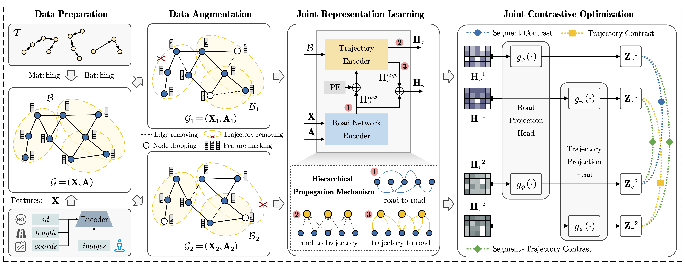

# UniTR: A Unified Framework for Joint Representation Learning of Trajectories and Road Networks
> :sparkles: This repo is the Pytorch implementation of our paper published in **AAAI 2025**

## :rocket: Quick Start
A detailed data processing and running tutorial will be released soon.
